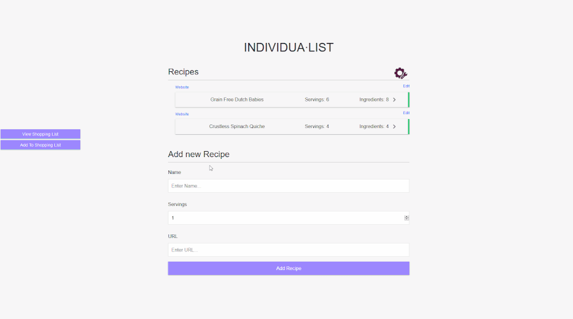

<br/>
<h1 align="center" >
	  INDIVIDUA&#8729;LIST
</h1>
<h4 align="center">Save recipes and easily create custom shopping lists</h4>

<p align="center">
  <a href="http://myindividualist.com/">Demo</a> •
  <a href="#features">Features</a> •
  <a href="#tutorial">Tutorial</a> • 
  <a href="#installation">Installation</a> •
  <a href="#contributing">Contributing</a>

</p>

# Features

#### Save and Edit Recipes

Found a delicious recipe online? Create a new recipe and save each ingredient and link the website. Made a mistake? No problem delete the recipe or edit the incorrect values and save.

#### Persistent shopping list

Easily create shopping list by adding all ingredients from recipe with a single click or add single items as you think of them. All items on the shopping list will be listed with other items from the same grocery section.

#### Custom Grocery Sections

Create a list of grocery sections ex: Produce, Vegetables, Frozen, Other ... When saving a new ingredient for a recipe set the grocery section value from one in the list. Add items to your shopping list based on the grocery section.

# Tutorial



# Installation

1. Clone this repository from your terminal

    `$ https://github.com/jrvanderveen/cooking-with-code`

2. Setup

```
npm install
cd client npm install
cd ..

# Run front and backend
npm run dev

# Backend only
npm run server

# Frontend only
npm run client

# Build client
cd client
npm run build

# Prod (Prereq build client)
npm start
```

4. Create a MongoDB database

5. `cd config` Create `config.env` file with values:

```
# development / production
NODE_ENV=development
PORT=5000
MONGO_URI=Your Mongo URI
# verbose = everything on
# limited = only basic server logging
LOGING_LEVEL=limited
SESSION_SECRET=seceret hash string
```

1. Generate create `./SSL/server.key.pem`, `./SSL/intermediate.crt.pem`, and `./SSL/server.crt.pem` files in the main folder. Open SSL is a great freee tool for this. Note: the `./SSL/server.crt.pem` should be purchsed from a CA.

2. Start with `npm run dev`

# Contributing

Want to help? Great! Checkout the [project](https://github.com/jrvanderveen/cooking-with-code/projects/1) and find something you'd like to tackle.
